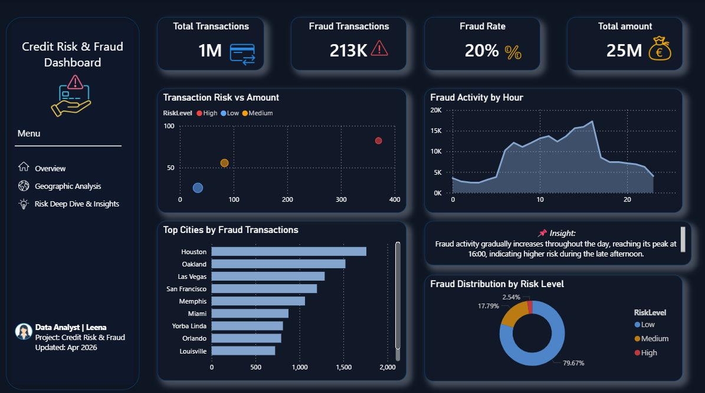
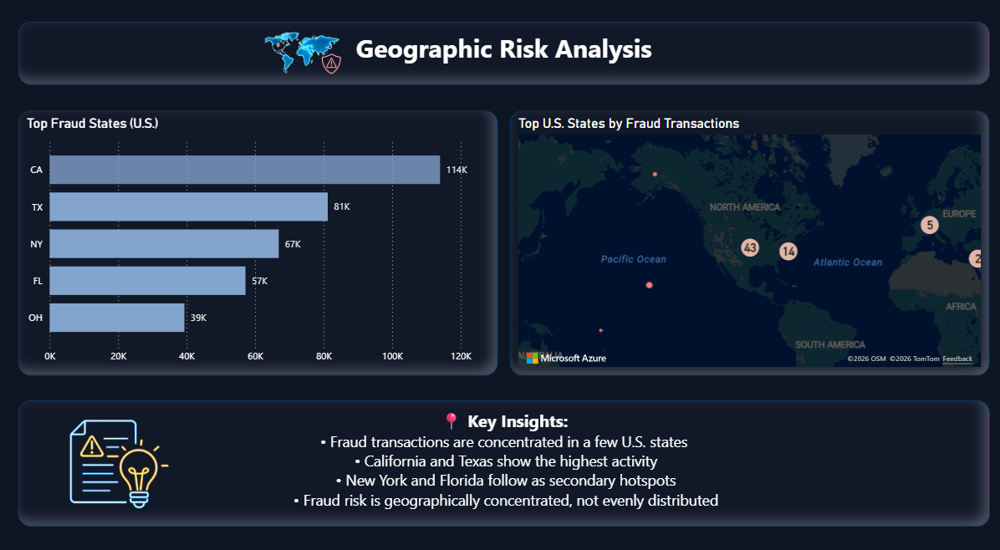
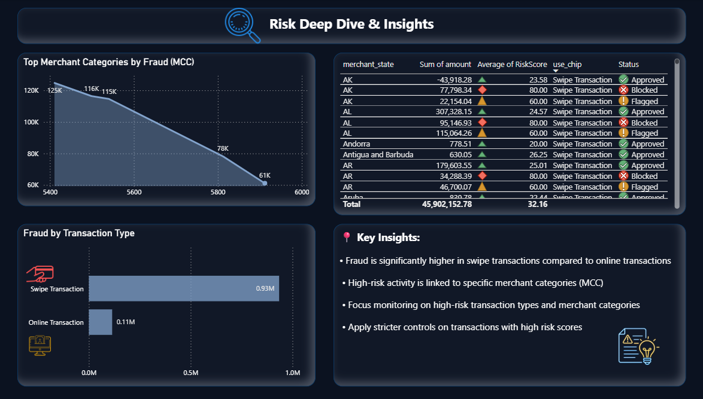

# Fraud & Credit Risk Dashboard

This project analyzes fraud patterns across time, geography, and transaction behavior using interactive dashboards.

## Tools
- Excel (Data Cleaning & Preprocessing)
- Power BI (Data Modeling & Visualization)

## Key Insights
- Fraud activity peaks around 16:00 (~17K transactions) → highest risk period  
- High-risk transactions represent ~20% (~213K out of 1M) → significant fraud exposure  
- Fraud is concentrated in regions like CA (~114K) and TX (~81K) → geographic hotspots  
- Swipe transactions (~0.93M) exceed online (~0.11M) → higher fraud risk  

## Dashboard Preview

